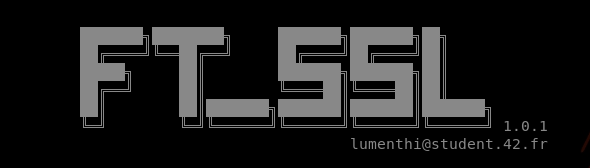

# ssl_md5 [](https://shields.io/) [](https://shields.io/) [](https://shields.io/)



Recreate part of the OpenSSL functionality, implementation of md5 and sha256 hashing functions in C.

## Summary
* [Introduction](#introduction)
* [Features](#features)
* [Options](#options)
* [Installation](#installation)
* [Usage](#usage)
* [Examples](#examples)
* [Compatibility](#compatibility)
* [Authors](#authors)

## Introduction
OpenSSL is a cryptographic toolkit library written C that is used to secure communications over computer networks. It implements the Secure Sockets Layer (SSL) and
Transport Layer Security (TLS) network protocols to protect against eavesdropping
and verify identities during network communication.

## Features
- Available hash algorithms:
    * __MD5__: The MD5 message-digest algorithm is a widely used hash function producing a 128-bit hash value. MD5 was designed by Ronald Rivest in 1991 to replace an earlier hash function MD4,[3] and was specified in 1992 as RFC 1321.
    * __SHA256__: SHA-2 (Secure Hash Algorithm 2), of which SHA-256 is a part, is one of the most popular hash algorithms around.
- Input methods:
    * File
    * String
    * Standard input  
`Note that multiple strings from multiple inputs can be computed in a single call.`
  
## Options
* `-p --print: echo STDIN to STDOUT and append the checksum to STDOUT`
* `-s --string: Print the sum of the given string`
* `-r --reverse: Reverse the format of the output`
* `-q --quiet: Quiet mode`
* `-v --verbose: Display informations about what ft_ssl is doing`
* `-h --help: Display the help menu`
* `-V --version: Output the current version of this software`

## Installation
Run `make` to compile the project, make will compile the binary `ft_ssl`.

## Usage
Be sure to check the help menu with `./ft_ssl -h`.  
```
USAGE:
  ft_ssl [md5|sha256] [File(s)] [Options]
```

## Examples
Here are some usage examples for ft_ssl
- `./ft_ssl md5 -s "string1" -s "string2" /tmp/my_file`
```
MD5 file(/tmp/my_file) = 9e6dc8685bf3c1b338f2011ace904887
MD5 string("string1") = 34b577be20fbc15477aadb9a08101ff9
MD5 string("string2") = 91c0c59c8f6fc9aa2dc99a89f2fd0ab5
```
- `echo -n "42" | ./ft_ssl sha256 --verbose`
```
======SUMMARY======
Algorithm: sha256
Message: [42]
Length: 2
Input mode: STDIN
Verbose: TRUE
Quiet: FALSE
Reverse: FALSE
Print: FALSE
===================
[*] Dividing the message in 1 chunk(s) of 512 bits
[*] Starting the calculation process
[*] SHA256 Computing chunk 0
[*] Finished calculation process
[*] Freeing 1 chunk(s) of 512 bits
SHA256 stdin = 73475cb40a568e8da8a045ced110137e159f890ac4da883b6b17dc651b3a8049
[*] SHA256 Done
```
- `echo -n "sdtin message" | ./ft_ssl md5 -s "message" -rp`
```
78e731027d8fd50ed642340b7c9a63b3  "message"
1b44b86fb5a8e7644313c9d8fe56811b  stdin("sdtin message")
```
- `./ft_ssl sha256 -s "quiet output" -q `
```
928e689bf69e9f2775e6fbf512b48d6c89a2a7ed8e9c4af41e0c92b8c161530c
```
## Compatibility
This project is only compatible with Linux.

## Authors
* Ludovic Menthiller (https://github.com/lumenthi)
